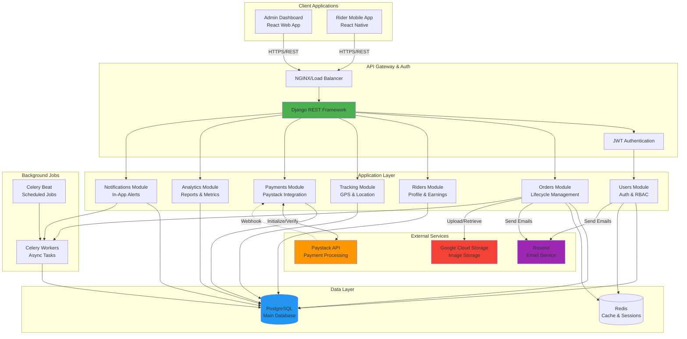

# Internal Logistics Platform - Backend API

Django REST Framework backend for managing logistics operations in Lagos.

## System Architecture



### Component Responsibilities

| Component | Purpose |
|-----------|---------|
| **Users Module** | Authentication, authorization, role management (Admin/Manager/Rider) |
| **Orders Module** | Order creation, assignment, status tracking, delivery lifecycle |
| **Riders Module** | Rider profiles, task management, earnings calculation |
| **Tracking Module** | Real-time GPS tracking, location history |
| **Payments Module** | Paystack integration, transaction verification, webhooks |
| **Analytics Module** | Business reports, metrics, trends analysis |
| **Notifications Module** | Event-driven notifications, in-app alerts |

## Features

- **Role-Based Authentication**: Admin, Manager, and Rider roles with JWT
- **Order Management**: Full lifecycle from creation to delivery
- **Real-time Tracking**: GPS location tracking for riders and orders
- **Payment Integration**: Paystack payment processing and webhooks
- **Analytics & Reporting**: Business metrics and performance insights
- **Notifications**: Event-driven notification system

## Tech Stack

- **Framework**: Django 5.0 + Django REST Framework
- **Database**: PostgreSQL
- **Authentication**: JWT (Simple JWT)
- **Payments**: Paystack API
- **Background Jobs**: Celery + Redis (optional)
- **API Docs**: Swagger/OpenAPI (drf-spectacular)

## Getting Started

### Prerequisites

- Python 3.10+
- PostgreSQL 14+
- Redis (optional, for Celery)

### Installation

1. **Clone the repository**
```bash
git clone <repository-url>
cd Delivery_Backend
```

2. **Create virtual environment**
```bash
python -m venv venv
source venv/bin/activate  # On Windows: venv\Scripts\activate
```

3. **Install dependencies**
```bash
pip install -r requirements.txt
```

4. **Set up environment variables**
```bash
cp .env.example .env
# Edit .env with your configuration
```

5. **Run database migrations**
```bash
python manage.py migrate
```

6. **Create superuser**
```bash
python manage.py createsuperuser
```

7. **Run development server**
```bash
python manage.py runserver
```

The API will be available at `http://localhost:8000/`

## API Documentation

- **Swagger UI**: http://localhost:8000/api/docs/
- **ReDoc**: http://localhost:8000/api/redoc/
- **OpenAPI Schema**: http://localhost:8000/api/schema/

## Project Structure

```
apps/
├── users/          # Authentication & user management
├── riders/         # Rider operations & profiles
├── orders/         # Order lifecycle management
├── tracking/       # GPS tracking & location
├── payments/       # Paystack integration
├── analytics/      # Reporting & metrics
├── notifications/  # Event notifications
└── common/         # Shared utilities
```

## API Endpoints

### Authentication
- `POST /api/users/register/` - Register new user (admin only)
- `POST /api/users/login/` - Login and get JWT tokens
- `POST /api/users/refresh/` - Refresh access token

### Orders
- `POST /api/orders/` - Create new order
- `GET /api/orders/` - List all orders
- `GET /api/orders/{id}/` - Order details
- `POST /api/orders/{id}/assign/` - Assign to rider

### Riders
- `GET /api/riders/tasks/` - Get rider's tasks
- `PATCH /api/riders/task/{id}/status/` - Update task status
- `GET /api/riders/earnings/` - View earnings

### Tracking
- `POST /api/tracking/location/` - Submit rider location
- `GET /api/tracking/orders/{id}/location/` - Track order

### Payments
- `POST /api/payments/initialize/` - Initialize payment
- `GET /api/payments/verify/` - Verify payment
- `POST /api/payments/webhook/` - Paystack webhook

### Analytics
- `GET /api/analytics/delivery-summary/` - Delivery statistics
- `GET /api/analytics/rider-performance/` - Rider metrics
- `GET /api/analytics/financials/` - Financial reports

## Running Tests

```bash
# Run all tests
python manage.py test

# Run with coverage
coverage run --source='.' manage.py test
coverage report
```

## Deployment

### Environment Variables

Ensure all production environment variables are set:
- `SECRET_KEY` - Django secret key
- `DEBUG=False`
- `ALLOWED_HOSTS` - Your domain
- `DATABASE_URL` - PostgreSQL connection string
- `PAYSTACK_SECRET_KEY` - Production Paystack key

### Deploy to Render/Railway

1. Create new web service
2. Set environment variables
3. Set build command: `pip install -r requirements.txt`
4. Set start command: `gunicorn config.wsgi:application`
5. Database will auto-create migrations

## Contributing

1. Create feature branch
2. Make changes with tests
3. Run tests and linting
4. Submit pull request

## License

Proprietary - Internal Use Only
